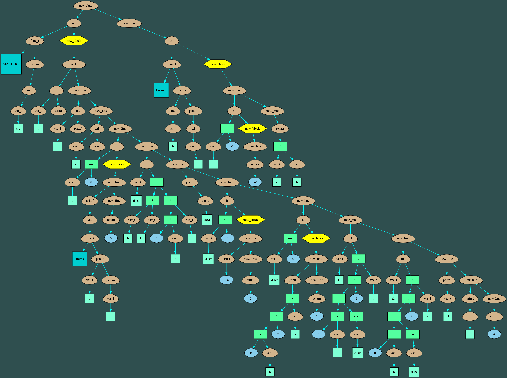
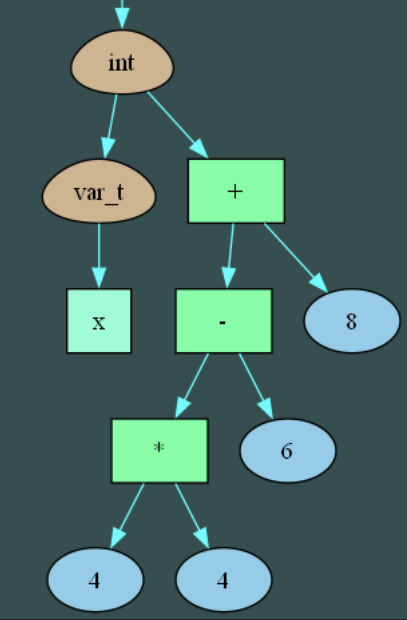
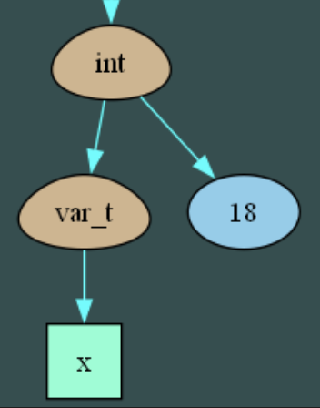
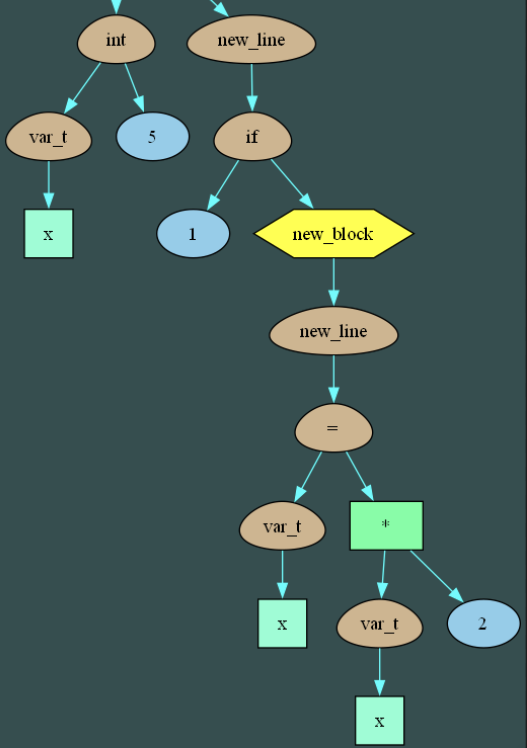
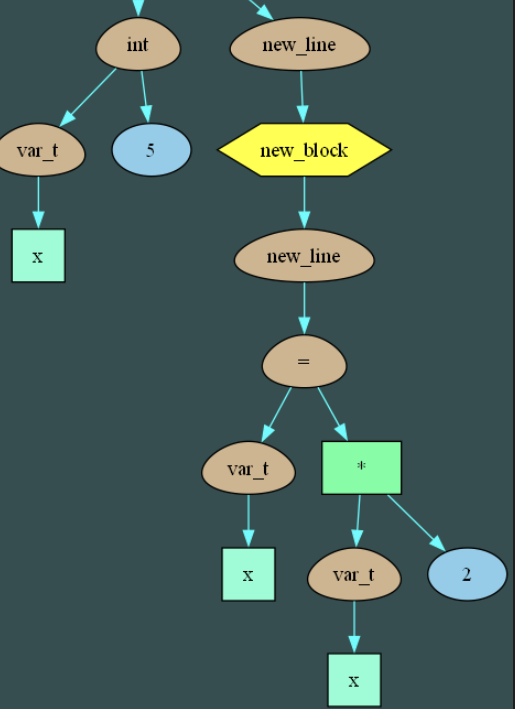

# Компилятор Панк-языка
Шелонин Арсений, студент 1 курса ФРКТ МФТИ 

## Описание проекта
Проект представляет собой продолжение [работы](https://github.com/71frukt/PUNK_LANGUAGE) из прошлого семестра. Он преобразует ваш код, написанный на моём панк-языке в ассемблерный код.

## Сборка и запуск
*Программа написана для системы Linux x86-64.*

### Сборка проекта:

```bash
$ git clone https://github.com/71frukt/PUNK_LANGUAGE.git
```

```bash
$ make
```

**Команды make:**
* `run_translator` - запуск трансляции в ассемблерный файл и сборка в исполняемый
* `run_asm` - запуск полученной программы
* `benchmark_translator`, `benchmark_spu` - замер времени работы программ, полученных транслятором в ассемблер и [компилятором](https://github.com/71frukt/PUNK_LANGUAGE) в мой ассемблер для [виртуального процессора](https://github.com/71frukt/SPU). 


## Синтаксис языка
### 1. Общие правила
Общая структура схожа со структурой языка Си. Ключевые детали:
* В программе должна существовать главная функция `MAIN_HOI`, в которой начнётся и закончится выполнение программы.
* Все числовые значения имеют единый тип - `int`.
* Функции могут принимать неограниченное количество аргументов.
* Имена переменных должны быть на английском языке
* Слова не на английском языке и не являющиеся ключевыми считаются комментариями

Панк-язык создаёт внутри стековый фрейм, что позволяет использовать в программах рекурсию и вложенные вызовы функций:

*Функция факториала на читаемом языке (не таком как мой :))*
```
инт fact ( инт n ) 
{
    если ( n < 1 )
    {
        рет 1 ;
    }
    
    рет n * fact ( n - 1 ) ;
}
```

Также каждый блок - часть кода, обрамленная фигурными скобками в примере и `панки_хой`, `попса_отстой` соответственно в моем синтаксисе - имеет свою таблицу имен, что позволяет языку поддерживать области видимости.

```
инт MAIN_HOI ( инт a )
{
    если ( 1 < 500 )
    {
        инт local = 777 ;
        принт ( local ) ;
    }

    инт local = 888 ; 
    принт ( local ) ;

    рет 0 ;
}
```

Программа отличает эти переменные:
```bash
./translator
777
888
```

Если же использовать во внешнем блоке переменную, определенную во внутреннем - синтаксический анализ выдаст ошибку: 
``` bash
SyntaxError called in src/tree.cpp:305 GetBlockNamesTable()
Error: Undefined variable named 'local'   (position 8:9)
```


### 2. Синтаксис
Синтаксис языка делится на три подгруппы: ключевые слова, управляющие слова и математические операторы.

### Ключевые слова

|Слово в Панк-языке | Аналог в Си | 
|-------------------|-------------|
| целый             |    int      |
| хой               |      ;      |
| вместе            |      ,      |
| теперь            |      =      |
| коль              |     if      |
| пока              |    while    |
| лес               |    return   |
| почитаю           |    scanf    |
| болтал            |    printf   |

### Управляющие слова
|Слово в Панк-языке | Аналог в Си | 
|-------------------|-------------|
| панки_хой         |      {      |
| попса_отстой      |      }      |
| желаешь           |      (      |
| расскажу          |      )      |

### Математические операции

| Слово в Панк-языке  | Аналог в Си |
|---------------------|-------------|
| будто               | ==          |
| ну_нафиг            | !=          |
| хиленький           | <           |
| хиленький           | <           |
| перехиленький       | <=          |
| недомощный          | >=          |
| накину              | +           |
| сдеру               | -           |
| помножу             | *           |
| порублю             | /           |


## Примеры программ

### Решение квадратного уравнения
Эта программа вычисляет решение уравнения $Ax^2 + Bx + C = 0$ , коэффициенты которого вводятся с консоли по очереди. Она иллюстрирует использование локальных переменных и вызовов функций с нескольким количеством переменных. Программа возвращает $666$, если решений нет, и $777$, если их бесконечно много. 

<details>
<summary>Решение квадратного уравнения на Панк-языке</summary>

```
будь как дома путник йа ни в чём не откажу
йа ни в чём не откажу
йа ни в чём не откажу

целый MAIN_HOI историй желаешь целый arg расскажу
панки_хой
    целый a теперь почитаю хой
    целый b теперь почитаю хой 
    целый c теперь почитаю хой

    коль желаешь a будто 0 расскажу
    панки_хой
        болтал Linerial желаешь b , c расскажу хой
        лес 0 хой
    попса_отстой

    целый discr теперь b помножу b сдеру 4 помножу a помножу c хой

    коль желаешь discr хиленький 0 расскажу
    панки_хой
        болтал 666 хой
        лес 0 хой
    попса_отстой

    коль желаешь discr будто 0 расскажу
    панки_хой
        болтал желаешь 0 сдеру b расскажу порублю 2 порублю a хой
        лес 0 хой
    попса_отстой

    целый x1 теперь желаешь 0 сдеру b сдеру корень желаешь discr расскажу расскажу порублю 2 порублю a хой
    целый x2 теперь желаешь 0 сдеру b накину корень желаешь discr расскажу расскажу порублю 2 порублю a хой

    болтал x1 хой
    болтал x2 хой

    лес 0 хой
попса_отстой

будь как дома путник йа ни в чём не откажу
йа ни в чём не откажу
йа ни в чём не откажу

целый Linerial историй желаешь целый b вместе с целый c расскажу
панки_хой
    коль желаешь b будто 0 расскажу
    панки_хой
        коль желаешь с будто 0
        панки_хой
            лес 777
        попса_отстой

        лес 666 хой
    попса_отстой

    И волки среди ночи завыли под окном
    Старик заулыбался и вдруг покинул дом
    Но вскоре возвратился с ружьём наперевес
    друзья хотят покушать пойдём приятель в лес 0 сдеру b порублю c хой
попса_отстой
```
</details>


<details>
<summary>Аналогичная программа на псевдокоде</summary>

```C
int main()
{
    int a = ReadInput;
    int b = ReadInput;
    int c = ReadInput;

    if (a == 0)
    {
        PrintOutput(Linerial(b, c));
        return 0;
    }

    int discr = b * b - 4 * a * c;

    if (discr < 0)
    {
        PrintOutput(666);
        return 0;
    }

    int x1 = (0 - b - sqrt(discr)) / 2 / a;
    int x1 = (0 - b + sqrt(discr)) / 2 / a;

    PrintOutput(x1);
    PrintOutput(x2);

    return 0;
}

int Linerial(int b, int c)
{
    if (b == 0)
    {
        if (c == 0)
            return(777);

        return(666);
    }

    return 0 - c / b;
}
```
</details>


### Вычисление факториала числа
Эта программа иллюстрирует возможности рекурсивного вызова функций. Она рекурсивно вычисляет значение факториала введенного в консоль числа.

<details>
<summary>Факториал на Панк-языке</summary>

```
будь как дома путник йа ни в чём не откажу
йа ни в чём не откажу
йа ни в чём не откажу

целый MAIN_HOI историй желаешь целый a расскажу
панки_хой
    И волки среди ночи завыли под окном
    Старик заулыбался и вдруг покинул дом
    Но вскоре возвратился с ружьём наперевес
    лес fact желаешь почитаю расскажу хой
попса_отстой

будь как дома путник йа ни в чём не откажу
йа ни в чём не откажу
йа ни в чём не откажу

целый fact желаешь в не целый n расскажу 
панки_хой
    коль желаешь n хиленький 1 значит мало расскажу
    панки_хой
        не пойдём приятель в лес 1 хой
    попса_отстой

    И волки среди ночи завыли под окном
    Старик заулыбался и вдруг покинул дом
    Но вскоре возвратился с ружьём наперевес
    друзья хотят покушать 
    пойдём приятель в лес n помножу fact желаешь n сдеру 1 расскажу хой
попса_отстой
```

</details>

<details>
<summary>Аналог на псевдокоде</summary>

```C
int main()
{
    return fact(ReadInput());
}

int fact(int n)
{
    if (n < 1)
        return 1;

    return n * fact(n - 1);
}
```
</details>


## Принцип работы компиллятора
Работа программы разделена на три этапа:
### 1. Frontend

Преобразует написанный на Панк-языке код в соответствующее ему дерево. Затем это дерево преобразуется в файл стандартизированного формата, который потом считывают другие этапы, восстанавливая по нему дерево для дальнейшей работы с ним. 

_Граф, полученный после работы фронтэнда_


### 2. Middle-end 

Читает дерево из файла оптимизирует его, сворачивая константы и условные переходы, результат которых известен на этапе компиляции. Результат работы так же записывается в файл.

| До оптимизации                        | После оптимизации                         |
|---------------------------------------|-------------------------------------------|
|  |      |
|     |         |


### 3. Построение IR и Backend 

Для простоты построения ассемблерного кода и приятного дебага удобно работать не с девовидным представлением кода, а линейным. Для этого сначала из дерева строится Linear Intermediate Representation (далее - просто IR), а затем из него линейно собирается ассемблерный код. IR состоит из базовых блоков - последовательностей инструкций в IR с одной точкой входа и одной точкой выхода, без ветвлений внутри. Например, вот IR для показанной выше функции факториала:


```
func(func_3_1)		                    # int fact(1 args)
		operation(tmp_0, <, var_0, 1)       # tmp_0 = var_0 < 1
		neg_cond_jump(label_0, tmp_0)       # jne label_0
		return(1)

		
	local_label(label_0)
		operation(tmp_1, -, var_0, 1)       # tmp_1 = var_0 - 1
		assign(arg_0, tmp_1)                # arg_0 = tmp_1
		call_func(tmp_2, func_3_1)		    # call fact(1 args)
		operation(tmp_3, *, var_0, tmp_2)   # tmp_3 = var_0 * tmp_2
		return(tmp_3)
```

## Структура IR:
| Base Block name         | Return value      | Operation      | Label       | First Operand       | Second Operand    |
|------------------------ |-------------------|----------------|------------ |---------------------|-------------------|
| `Call function`         | Tmp               | None           | None        | Func label          | None              |
| `Function body`         | None              | None           | Func label  | Number of arguments | None              |
| `(neg) Conditional jump`| None              | None           | None        | Local label         | Tmp               |
| `Assignment`            | None              | None           | None        | Var or Tmp or Arg   | Var or Tmp or Num |
| `Operation`             | Tmp               | math operation | None        | Var or Tmp or Num   | Var or Tmp or Num |
| `Local label`           | None              | None           | Local Label | None                | None              |
| `Return`                | Tmp or var or Num | None           | None        | None                | None              |
| `Call system function`  | Tmp               | None           | Func label  | Var or Tmp or Num   | None              |

### Структура базового блока
```C
struct IrBlock
{
    IrBlockType     block_type;
    IrOperationType op_type;      

    IrOperand ret_operand;
    IrOperand operand_1; 
    IrOperand operand_2;

    Label label;

    ON_IR_DEBUG(
    char comment[COMMENT_LEN];
    )
};

```

### О типах операндов базового блока

### 1. `tmp`
Временные переменные, хранящиеся на верхушке стека. Используются в математических и логических операциях, вызовах функций. IR разбивает все сложные операции на последовательную работу с tmp-переменными. Например, математическое выражение
```
инт x = 1 ;
инт y = 5 * x + 9 - 8 - x ;
```
 преобразуется в последовательность базовых блоков:

```
assign(var_1, 1)		            # int x = 1
operation(tmp_0, *, 5, var_1)       # tmp_0 = 5 * var_1
operation(tmp_1, +, tmp_0, 9)       # tmp_1 = tmp_0 + 9
operation(tmp_2, -, tmp_1, 8)       # tmp_2 = tmp_1 - 8
operation(tmp_3, -, tmp_2, var_1)   # var_1 = tmp_2 - var_1
assign(var_2, tmp_3)		        # int y
```

### 2. `var`

Это переменные, определенные пользователем. Имеют зарезервированное место в стековом фрейме в своей области видимости. 

#### Про области видимости
Для каждого блока в дереве отделяется отдельный узел с именем `new_block`. В нем находится его собственная таблица имен, в которой каждой переменной определен номер. Цель таблиц имён - получить смещение каждой переменной относительно начала стекового фрейма. Стоит пояснить, как это рассчитывается в моём случае. 

Пусть есть некоторый блок, в котором также находится m других блоков. Тогда пусть в k-том блоке(до которого в изначальном блоке было определено `p` переменных) определена переменная `var_n`, n-тая в этом блоке. Тогда смещение относительно начального блока равно `shift = (p + n) * sizeof(var)`. Так рекурсивно определяется глобальное смещение относительно блока функции, и любая переменная становится доступна по адресу `[rbp - shift]`.


<image src="readme_images/name_tables.png" alt="3s" width=60%>

### 3. `label`
Существует два вида меток - локальные метки и метки для функций. Метка для функций также содержит информацию о количестве аргументов. Условия и циклы в IR представляются как последовательность условных переходов на локальные метки.

### 4. `arg`
Обозначает положение аргумента функции в стек - просто удобный синтаксис. 

### Поля базовых блоков

|  Поле           |   Пояснение        
|-----------------|----------------------------------------------------------
| Base Block name | Имя базового блока 
| Return value    | Возвращаемое значение блока - может быть только `tmp`
| Operation       | Если блок типа операции - это поле равно соответствующему номеру математической операции
| Label           | Собственная метка блока. Очевидно, что определена только для тела функции или локальной метки
| 1-st, 2-nd operands | Соответствующие 1 и 2 операнды блока


## Сравнение производительности с версией на виртуальном процессоре

### Эталонная машина
* Процессор - Intel Core Ultra 5 125H
* Частота процессора при измерениях - 2000MHz
* OC - Manjaro Linux

Программа запускалась и тестировалась следующими инструментами:

| Программа       |  Версия         |
|-----------------|-----------------|
| gcc             | 14.2.1          |
| perf            | 6.14-1          |
| cpupower        | 6.14-1          |
| nice            | 9.6             |


Тестировать будем программу расчёта факториала от 5 в цикле с 500 итерациями:

<details>
<summary>Тестируемая программа</summary>

```C
инт MAIN_HOI ( инт a )
{
    инт i = 0 ;

    пока ( i < 500 )
    {
        fact ( 5 ) ;
        i = i + 1 ;
    }

    рет 0 ;
}

инт fact ( инт n ) 
{
    если ( n < 1 )
    {
        рет 1 ;
    }
    
    рет n * fact ( n - 1 ) ;
}
```
</details>

<br>


Полученные результаты:

|Эксперимент | Транслятор в ассемблер | Транслятор в мой ассемблер для виртуального процессора |
|------------|------------------------|--------------------|
| 1          | 32 811                 | 21 708 561 618     |
| 2          | 44 760                 | 21 664 292 031     |
| 3          | 39 977                 | 21 493 836 936     |
| 4          | 32 823                 | 21 737 210 918     |
| 5          | 47 726                 | 21 663 340 732     |
| 6          | 38 354                 | 21 677 607 603     |
| 7          | 58 298                 | 21 656 426 860     |
| 8          | 34 459                 | 21 676 835 472     |
| 9          | 33 727                 | 21 495 428 628     |
| 10         | 62 107                 | 21 659 441 203     |
|**среднее** | **42 504**             | **21 643 298 200** |


То есть мы получили прирост в около **500 000 раз**. 


Таким образом, проект реализует базовые принципы настоящего языка и обладает минимальным набором возможностей, позволяющих писать осмысленный код.